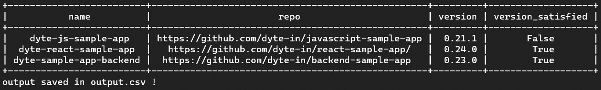
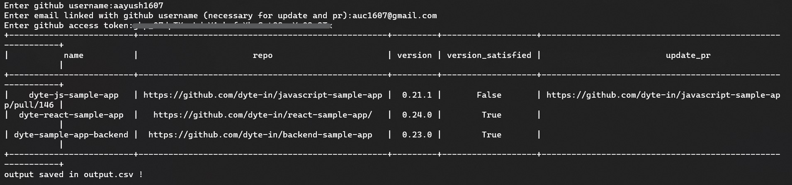

<!-- PROJECT LOGO -->
<h1 align="center">✨ Version Manager ✨</h1>
<p align="center">

</p>

  <p align="center">
    A simple lightweight cli tool that checks and updates dependency versions on all your node js github repos.  <br/>
    Package Published on PyPI - https://pypi.org/project/VM-for-Dyte/
    <br />
  </p>
</div>

### Built With

* [Python](https://www.python.org/)
* [Github API](https://docs.github.com/en/rest)

<p align="right">(<a href="#top">back to top</a>)</p>

## Setup:

#### Step-0: Environment you are running should have python 3 and pip installed that's it
```
# check python version
python --version

# if not installed install using
sudo apt-get install python3

# for mac os you can see docs -https://www.python.org/downloads/macos/

# install pip
sudo apt-get install python3-pip python-dev

# for mac os
curl https://bootstrap.pypa.io/get-pip.py -o get-pip.py
python3 get-pip.py

```

#### Step-1 : Install the vm package which is released by me from [here](https://pypi.org/project/VM-for-Dyte/)
```
pip install VM-for-Dyte
```
#### Step-2 : Start using the tool
  ###### Example 1: To check that all repos in repo.csv file has axios >= 0.23.0
```
vm -i repo.csv axios@0.23.0
```
  ###### Example output 1:
  
  Output also gets saved in output.csv in current directory.

  ###### Example 2: To check that all repos in repo.csv file has axios >= 0.23.0 and if not satistfied update and create pull request
```
vm -u -i repo.csv axios@0.23.0
```
  ###### Example output 2:
  
  Output also gets saved in output.csv in current directory.

That's all for the tutorial.


##### In case you if you want to locally run the package after cloning the repo just use [version_manager.py](https://github.com/dyte-submissions/dyte-vit-2022-aayush1607/blob/main/version_manager.py) file.

##### Steps for running locally: 

##### STEP-1 : Clone this repository
```
git clone https://github.com/dyte-submissions/dyte-vit-2022-aayush1607.git
cd dyte-vit-2022-aayush1607
```
##### STEP-2 : Create a new virtual environment for your project
```
python -m venv YOUR_ENV
```
##### STEP-3 : Activate ENV
```
source YOUR_ENV/bin/activate
```
##### STEP-3 : Download Dependencies
```
pip install -r requirements.txt
```
##### STEP-4 : Finally Start using [version_manager.py](https://github.com/dyte-submissions/dyte-vit-2022-aayush1607/blob/main/version_manager.py)
```
python version_manager.py -i repo.csv axios@0.23.0
            OR
python3 version_manager.py -i repo.csv axios@0.23.0
```
  ###### Example output:
  
  Output also gets saved in output.csv in current directory.  

```
python version_manager.py -u -i repo.csv axios@0.23.0
            OR
python3 version_manager.py -u -i repo.csv axios@0.23.0
```
  ###### Example output:
  
  Output also gets saved in output.csv in current directory.
  
<!-- CONTACT -->
## Contact

Aayush Chodvadiya - [@linkedin](https://www.linkedin.com/in/aayush-chodvadiya/) - auc1607@gmail.com

Project Link: [https://github.com/dyte-submissions/dyte-vit-2022-aayush1607](https://github.com/dyte-submissions/dyte-vit-2022-aayush1607)

<p align="right">(<a href="#top">back to top</a>)</p>
